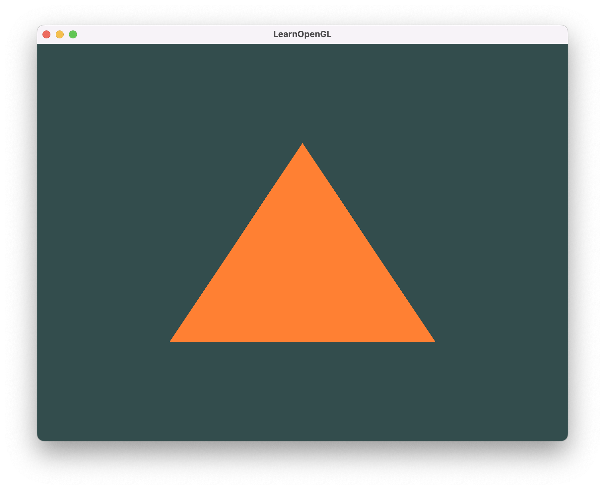

# LearnOpenGL Tutorial Code

Code for https://learnopengl.com/

Tested on macOS (both Intel and ARM archs).

This allows you to skip the boring setup bits of Learn OpenGL tutorial (setting
up glad, glfw, the window, etc. - though it's good to understand what they are
doing), and head straight to the good parts.

1. Checkout the initial commit.
2. Install glfw - `brew install glfw`
3. In project root, execute `make run`

If everything works fine, you should see a window with an orange triangle
below as you see below:

This is the same image that you will see if you worked through most of the
[Hello Triangle](https://learnopengl.com/Getting-started/Hello-Triangle)
topic. At this point, you should start from the beginning of this topic and read
the code to understand what's going on, after that you can work through the rest
of the tutorial on your own.
